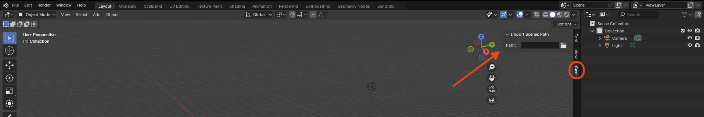
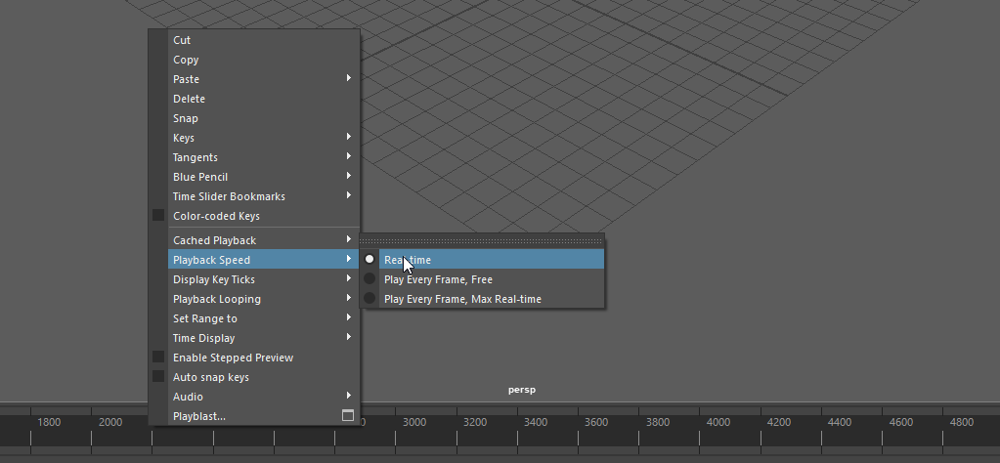

# Cast | Frequently asked questions

### Q: In Autodesk Maya, why doesn't cast set the animation range when importing an animation:
A: In later versions of maya, they added import options. To configure them go to `File -> Import (Click the Square)` then set your playback settings to match: 

### Q: When importing with IK Handles enabled, the model looks broken:
A: Some games may bake their rest positions away, so that while idle, the model will look odd. Importing an animation from the game will make it look normal. You can also move the respected IK Handles if you are animating manually.

### Q: When importing worlds into Blender, I get the error "Unable to import instances without a root directory!"
A: You must set the directory where the world models have been exported to in the cast menu tab on the right hand side of the ui: 

> **NOTICE**: The latest cast specification allows skipping this step, if your plugins are up-to-date and tools support the scene directory metadata. If all of those conditions are met, you may have moved the files from their original folders.

### Q: When I import an animation in Autodesk Maya, the animation playback does not match the fps.
A: You can configure your scene to use "Real-time" playback speed, which will match the fps of the animation by right-clicking the timeline selecting `Playback Speed -> Real-time` this setting will persist scenes: 