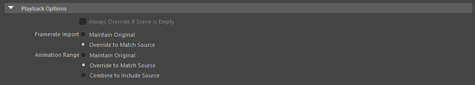

# Cast | Frequently asked questions

### Q: In Autodesk Maya, why doesn't cast set the animation range when importing an animation:
A: In later versions of maya, they added import options. To configure them go to `File -> Import (Click the Square)` then set your playback settings to match: 

### Q: When importing with IK Handles enabled, the model looks broken:
A: Some games may bake their rest positions away, so that while idle, the model will look odd. Importing an animation from the game will make it look normal. You can also move the respected IK Handles if you are animating manually.